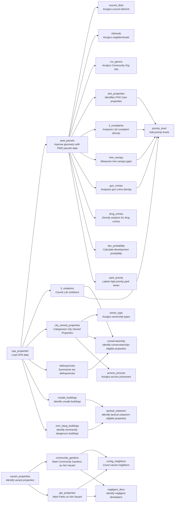

## DAG for the new ETL Pipline

In practice, functions are run sequentially but this DAG shows dependencies on prior data modifications/additions.

```mermaid
%%{init: {'flowchart': {'nodeSpacing': 100, 'rankSpacing': 50}}}%%
graph LR
    %% Initial Ingestion
    OP[opa_properties<br><em>Load OPA data</em>]
    VP[vacant_properties<br><em>Identify vacant properties</em>]

    %% First updates from ingestion
    OP --> PP[pwd_parcels<br><em>Improve geometry with PWD parcels data</em>]
    OP --> LV[li_violations<br><em>Counts L&I violations</em>]
    OP --> CO[city_owned_properties<br><em>Categorizes City Owned Properties</em>]
    OP --> DL[delinquencies<br><em>Summarize tax delinquencies</em>]
    OP --> UB[unsafe_buildings<br><em>Identify unsafe buildings</em>]
    OP --> IDB[imm_dang_buildings<br><em>Identify imminently dangerous buildings</em>]

    VP --> CG[community_gardens<br><em>Mark Community Gardens as Not Vacant</em>]
    VP --> PPR[ppr_properties<br><em>Mark Parks as Not Vacant</em>]

    %% Branches from pwd_parcels (updated geometry)
    PP --> CD[council_dists<br><em>Assigns council districts</em>]
    PP --> NB[nbhoods<br><em>Assigns neighborhoods</em>]
    PP --> RC[rco_geoms<br><em>Assigns Community Org Info</em>]
    PP --> PH[phs_properties<br><em>Identifies PHS Care properties</em>]
    PP --> LC[li_complaints<br><em>Analyzes L&I complaint density</em>]
    PP --> TC[tree_canopy<br><em>Measures tree canopy gaps</em>]
    PP --> GC[gun_crimes<br><em>Analyzes gun crime density</em>]
    PP --> DC[drug_crimes<br><em>Density analysis for drug crimes</em>]
    PP --> DP[dev_probability<br><em>Calculate development probability</em>]
    PP --> PPri[park_priority<br><em>Labels high-priority park areas</em>]

    %% Updates from city ownership branch
    CO --> OT[owner_type<br><em>Assigns ownership types</em>]
    CO --> CV[conservatorship<br><em>Identify conservatorship-eligible properties</em>]
    CO --> AP[access_process<br><em>Assigns access processes</em>]

    %% Additional dependencies feeding into conservatorship
    LV --> CV
    DL --> CV

    %% Combining multiple updates for tactical urbanism
    UB --> TU[tactical_urbanism<br><em>Identify tactical urbanism-eligible properties</em>]
    IDB --> TU

    %% Vacant branch updates feeding subsequent functions
    CG --> CN[contig_neighbors<br><em>Count vacant neighbors</em>]
    PPR --> CN
    CG --> ND[negligent_devs<br><em>Identify negligent developers</em>]
    PPR --> ND

    %% Priority level depends on several geometry-based outputs
    GC --> PL[priority_level<br><em>Add priority levels</em>]
    LV --> PL
    LC --> PL
    TC --> PL
    PH --> PL
```
